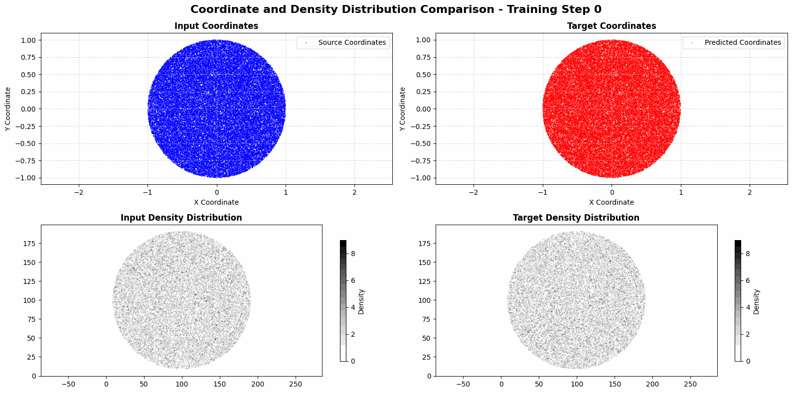

# ReflectorML

Free-form reflector design is essential in optics for precisely shaping light distributions, with applications in automotive lighting, energy-efficient LED optics, laser-based manufacturing, aerospace systems, and medical imaging.
This problem is mathematically formulated as a non- linear Monge–Ampère equation, which defines the mapping between a given light source and a prescribed target intensity.
However, traditional numerical solvers for this equation are computationally expensive and often struggle with convergence, particularly in complex boundary conditions.
Developing efficient and robust methods to solve this problem is crucial for advancing high-performance optical designs in both scientific and industrial applications.

We aim to develop physics-informed neural networks (PINNs) to solve inverse problems in free-form optical design.
By embedding the governing equations—such as the Monge–Ampère equation—directly into the learning process, our approach ensures physically consistent solutions while significantly reducing computational costs.
Unlike purely data-driven models, PINNs do not rely solely on labeled data but instead enforce optical constraints during training, improving solution accuracy for specific problem instances.
This framework accelerates the inverse design process and provides a computationally efficient alternative to traditional numerical solvers.

- - -

