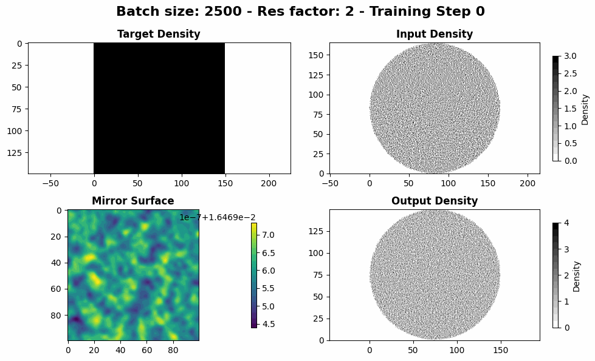
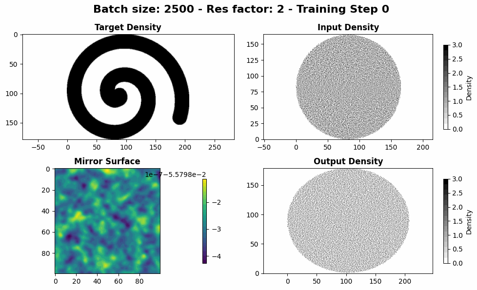
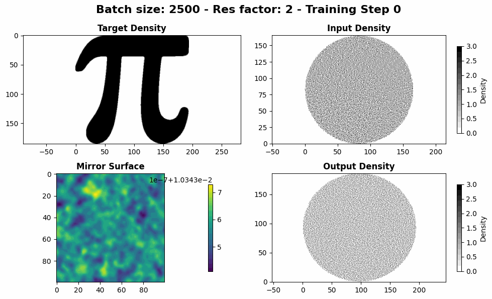
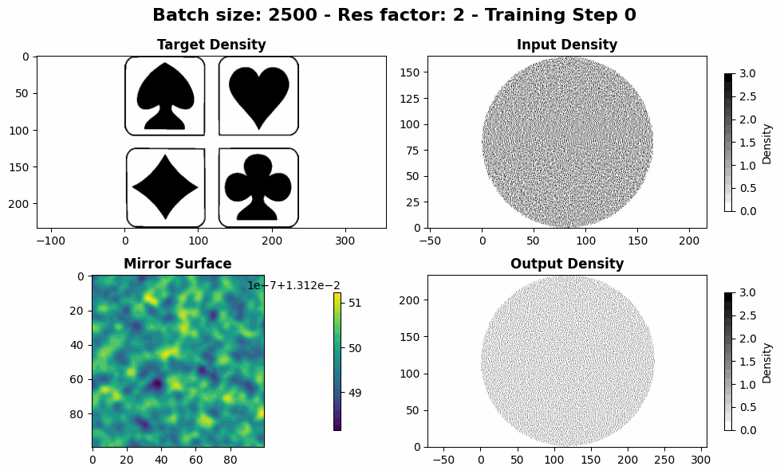

# ReflectorML

## Introduction

Free-form reflector design is essential in optics for precisely shaping light distributions, with applications in automotive lighting, energy-efficient LED optics, laser-based manufacturing, aerospace systems, and medical imaging.

This problem is mathematically formulated as a non-linear Monge-Ampère equation ([Wikipedia](https://en.wikipedia.org/wiki/Monge%E2%80%93Amp%C3%A8re_equation)), which defines the mapping between a given light source and a prescribed target intensity.

However, traditional numerical solvers for this equation are computationally expensive and often struggle with convergence, particularly in complex boundary conditions.
Developing efficient and robust methods to solve this problem is crucial for advancing high-performance optical designs in both scientific and industrial applications.

By embedding the governing equations - such as the Monge-Ampère equation - directly into the learning process, our approach ensures physically consistent solutions while significantly reducing computational costs.
Unlike purely data-driven models, PINNs do not rely solely on labeled data but instead enforce optical constraints during training, improving solution accuracy for specific problem instances.
This framework accelerates the inverse design process and provides a computationally efficient alternative to traditional numerical solvers.

## Getting Started

### Prerequisites

Ensure you have the following installed:

- Python 3.7 or higher
- Required libraries (listed in `requirements.txt`)

### Installation

Clone the repository:

```bash
git clone  https://github.com/Alexin-CH/ReflectorML.git
cd ReflectorML
```

Install the required dependencies:
``` bash
make
```

## Description

This project implements a hybrid method that aims to use both:
- PyTorch raytracer (with automatic differentiation) with a transport loss
- Physical loss based on the Monge-Ampere equation.

- - -

## Results ([See more](images/))

### Square


### Spiral


### Pi


### Cards


[See more results](images/)

- - -

## Acknowledgments

This project is inspired by the paper **"A Neural Network Approach for Solving the Monge-Ampère Equation with Transport Boundary Condition"** (arXiv:2410.19496v1, Oct 25, 2024).
You can read the paper [here](https://arxiv.org/abs/2410.19496).

## Thanks

Special thanks to **[Valentin MALQUY](https://github.com/Valentin-Malquy)** for their preliminary work on this topic. Your contributions and insights have been invaluable in shaping this project.
